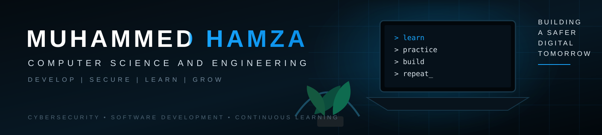

## 👋 Hey there! 👋

I’m **Muhammed Hamza**, a final-year **Computer Science & Engineering** student at **K.S. Institute of Technology**. I’m passionate about **cybersecurity, ethical hacking, software development, and exploring new technologies**. I enjoy learning, building, and solving real-world problems.

`🔐 Cybersecurity` &nbsp; `🛡️ Ethical Hacking` &nbsp; `🌐 Web Development` &nbsp; `🐧 Linux` &nbsp; `💡 Problem Solving` &nbsp; `📚 Continuous Learning`

---

## 🧑‍💻 About Me

- 🎓 Final-year Computer Science & Engineering student
- 🔐 Cybersecurity, penetration testing and secure development
- 💻 Software and web development
- 🐧 Linux, networking and security tools
- 🧠 Data structures, algorithms and problem solving

## 🔭 Currently Exploring

- Cybersecurity & Penetration Testing
- Cloud Security
- Full-Stack Development
- System Administration
- Open Source

## 🛠️ Tech Stack

### Languages
     

### Web & Backend
    

### Databases & Security
     

---

## 🚀 Featured Projects

### 🥭 Mango Disease Prediction
**Collaborative Project** — A machine-learning based application focused on identifying mango diseases from leaf images, with a dedicated frontend for interacting with the prediction system.

**Focus:** Machine Learning • Computer Vision • React • Web Development

[🔗 View Project](https://github.com/manasmishra16/mango-frontend) · [🚀 Live Demo](https://mango-frontend-flax.vercel.app/)

### ❤️ Heart Disease Prediction
**Collaborative Project** — A machine-learning based project designed to predict the likelihood of heart disease using relevant health-related input features.

**Focus:** Machine Learning • Data Analysis • Prediction • Web Development

[🔗 View Project](https://github.com/manasmishra16/Heart-disease-prediction)

---

## 🎯 Current Focus

`BUILD` → `SECURE` → `LEARN` → `IMPROVE` → `REPEAT`

- Building practical software and web projects
- Strengthening cybersecurity and ethical hacking skills
- Improving DSA and problem solving
- Learning through hands-on experimentation
- Maintaining clean, documented repositories

---

## 🤝 Let's Connect

---

**BUILDING A SAFER DIGITAL TOMORROW**

⭐ *Small steps every day make a big difference.*

